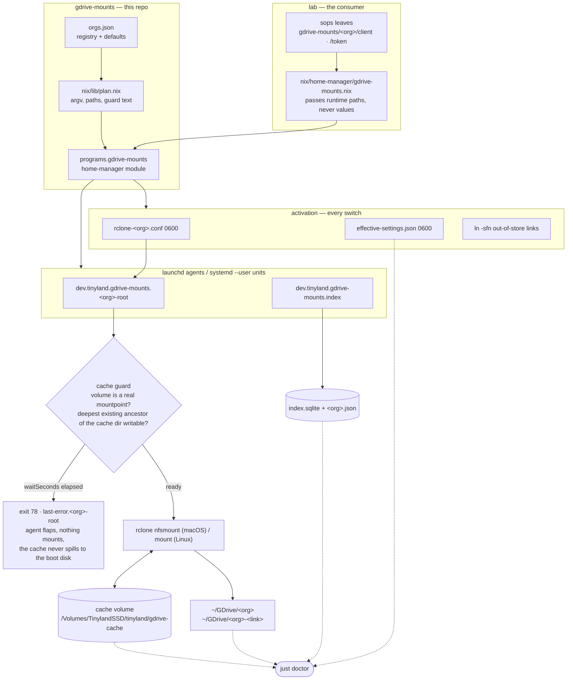

# gdrive-mounts

IaC for mounting multiple Google Workspace orgs' Drives as navigable,
indexable remote filesystems — macOS (kext-free NFS loopback) and Linux
(FUSE3) — via rclone, delivered by a nix flake and deployed through
home-manager (`lab`).

Public repo (visibility flipped 2026-08-18 so `lab` CI can fetch it as a flake input). MIT © 2026 Jess Sullivan. It holds no secret material by design — see `docs/sops-integration.md`.

## Quickstart

```console
nix develop --command just check    # all local gates
just --list                          # every recipe, inside the devShell
just doctor                          # live state, once secrets are wired
```

## Architecture

Secrets enter as file paths, never values. `orgs.json` and `nix/lib/plan.nix`
decide every path and every rclone flag. The home-manager module turns that
plan into one launchd agent (or systemd --user service) per org mount, plus one
index unit. Each agent runs a generated wrapper that guards the cache volume,
sweeps a stale mount, renders the config once, and then `exec`s rclone.



Every wrapper phase — start, guard, sweep, render, exec — writes one timestamped
line to the agent's stdout log, so a wrapper that never reaches rclone is
diagnosable from the log alone. Exit codes and operator probes:
`docs/runbook.md`.

## Layout

| Path | Role |
|---|---|
| `orgs.json` | Non-secret org registry (schema: `config/orgs.schema.json`) |
| `config/rclone.conf.template` | Per-org rclone stanza, no secrets, no comments |
| `scripts/` | The CLI surface: render, validate, index, doctor, import-client, mint-token, seed-lab, smoke, secrets-scan-dir, endpoint-free-check, repo-manifest-validate |
| `nix/modules/home-manager.nix` | `programs.gdrive-mounts` — launchd (macOS) / systemd --user (Linux) |
| `nix/lib/plan.nix` | Pure argv/plan builder shared by the module and its eval tests |
| `justfile` | The sole operator/agent entrypoint — see `AGENTS.md` |
| `docs/` | One topic per file — see `docs/INDEX.md` |
| `docs/evidence/` | Dated receipts (bakeoffs, acceptance runs) |

## Secrets

This repo holds none — see `docs/sops-integration.md`.

## Deploy

Consumed as a flake input by `lab`, wrapped by `lab`'s
`nix/home-manager/gdrive-mounts.nix`, secrets passed in as sops paths. See
`docs/adoption.md` for the full lace-up flow. Neo switches are
attended-only, operator-run.
